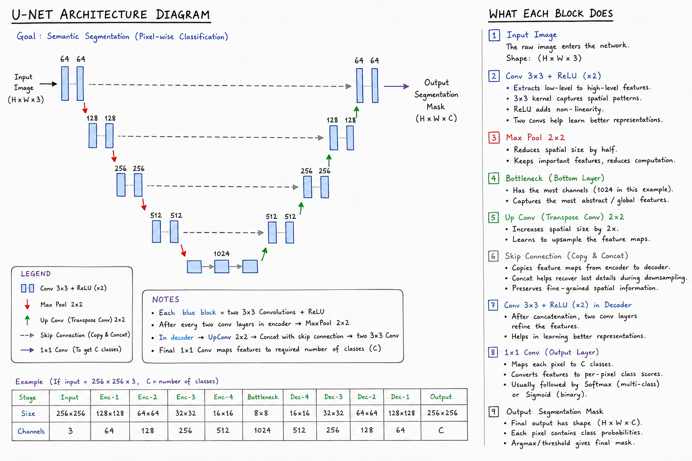

# Week 4 — Semantic Segmentation & U-Net

## Overview

The fourth week introduced semantic segmentation as an advanced computer-vision task focused on assigning class labels to individual pixels in an image.

The work focused on understanding the concepts behind semantic segmentation, its applications, the U-Net architecture, segmentation-specific losses and metrics, and the basics of preparing data for segmentation tasks.

## Topics Covered

* Semantic segmentation and its applications
* Difference between image classification, object detection, and semantic segmentation
* Segmentation masks and pixel-level labels
* U-Net architecture
* Encoder and feature extraction
* Bottleneck
* Decoder and upsampling
* Skip connections
* Role of skip connections in recovering spatial information
* Dice loss
* Intersection over Union (IoU)
* Data augmentation basics
* Basic semantic-segmentation workflow

## Practical Work

The concepts were reinforced through explanations, visual examples, and practical exploration of segmentation datasets and masks.

The Oxford-IIIT Pet dataset was used to understand the relationship between input images and their corresponding segmentation masks. The U-Net architecture was studied block by block to understand how the encoder, bottleneck, decoder, and skip connections work together to produce pixel-level predictions.

Dice loss, IoU, and augmentation were also explored to understand how segmentation models are trained and evaluated.

The practical implementation of a complete U-Net model was not completed during this stage. Since semantic segmentation is considerably more complex than the classification tasks covered previously, the focus remained on developing a solid conceptual understanding and gaining initial practical exposure.

## Google Colab Notebooks

* [Semantic Segmentation & U-Net Architecture](https://colab.research.google.com/drive/1dOi1VMgdK6prBRbFZ_99gKRWSnAvJvMJ?usp=sharing)
* [Segmentation Losses & Metrics](https://colab.research.google.com/drive/1GRjGosP0gccTIe0m_HtRVLAhOa5p4v1_?usp=sharing)

The following diagram illustrates the U-Net architecture, including the encoder, bottleneck, decoder, and skip connections, along with the purpose of each major block.

  

## Learning Outcomes

By the end of the week, I was able to:

* Explain the purpose and applications of semantic segmentation
* Distinguish semantic segmentation from image classification and object detection
* Understand the purpose of segmentation masks
* Explain the main components of the U-Net architecture
* Understand the roles of the encoder, bottleneck, and decoder
* Explain how skip connections preserve spatial information
* Understand the purpose of Dice loss and IoU
* Understand the basic role of augmentation in segmentation tasks
* Describe the general workflow of a semantic-segmentation system

## Summary

Week 4 introduced a more advanced area of computer vision and shifted the focus from image-level classification toward pixel-level prediction. The study of semantic segmentation, U-Net, segmentation masks, Dice loss, IoU, and augmentation established the conceptual foundation required for further practical work with segmentation models.
