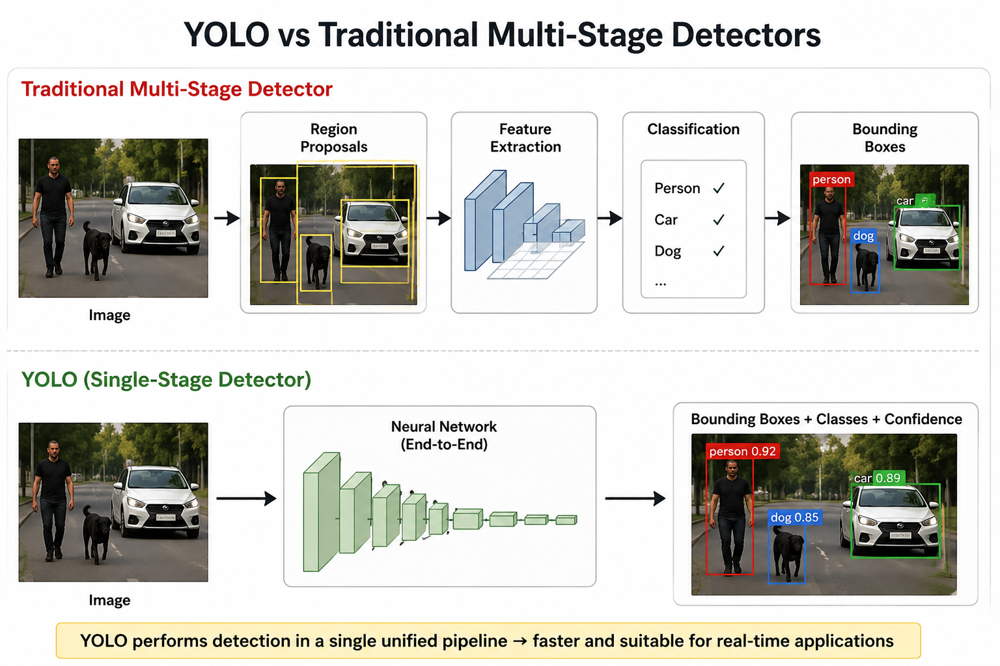

# Week 5 — Object Detection & YOLO

## Overview

The fifth week introduced the fundamental concepts of object detection and the YOLO family of real-time object-detection models.

The focus was on understanding how object detection differs from image classification, how detected objects are represented using bounding boxes, and how Intersection over Union (IoU) is used to evaluate the quality of predicted bounding boxes.

The week then progressed to the basic architecture and working principle of YOLO, followed by practical experimentation with YOLOv5 and an introduction to post-processing techniques such as Non-Maximum Suppression (NMS) and confidence thresholding.

## Topics Covered

* Object detection fundamentals
* Bounding boxes and object localization
* Intersection over Union (IoU)
* Mean Average Precision (mAP)
* YOLO architecture and its single-stage detection approach
* Anchor boxes and their role in object detection
* Prediction heads and detection outputs
* YOLOv5 architecture and practical inference
* Confidence scores and predicted bounding boxes
* Non-Maximum Suppression (NMS)
* Confidence thresholding
* Comparison between YOLO and traditional multi-stage object detectors
* Advantages of YOLO for real-time object detection

## Practical Work

A practical YOLOv5 experiment was performed on a sample image to understand the complete object-detection workflow.

The experiment involved loading a pretrained YOLOv5 model, providing an input image, running inference, and examining the resulting bounding boxes, class labels, and confidence scores.

The same detection output was used during the review stage to understand how YOLO produces predictions and why post-processing is required to remove redundant detections.

## Google Colab Notebook

* [YOLOv5 Object Detection Practice](https://colab.research.google.com/drive/1Z-DS-5OMPQkQGpoogz41HxPkhAysPzMB?usp=sharing)

  

## Learning Outcomes

By the end of the week, I was able to:

* Explain the difference between image classification and object detection
* Understand bounding boxes and their representation
* Explain the purpose of IoU in object detection
* Understand the basic idea behind mAP
* Describe the single-stage detection approach used by YOLO
* Understand the role of anchor boxes and prediction heads
* Run a pretrained YOLOv5 model on an image
* Interpret detected classes, bounding boxes, and confidence scores
* Understand why NMS and confidence thresholding are required
* Explain why YOLO is suitable for real-time object detection

## Summary

Week 5 introduced object detection as a progression from image-level classification to locating and classifying multiple objects within an image. YOLO was studied as a single-stage object-detection approach designed for efficient and real-time inference.

The practical YOLOv5 experiment provided hands-on understanding of the detection pipeline, while the review work focused on interpreting the model's output and understanding the role of post-processing techniques such as NMS and confidence thresholding.
